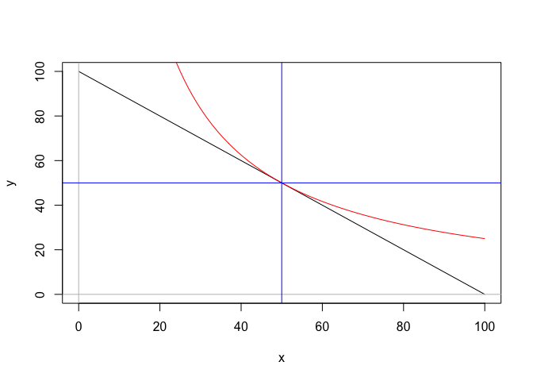
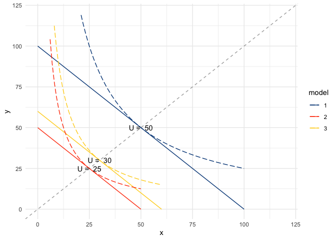

Easy Cobb-Douglas Utility Function
================

The `microecon` package is a simple package allowing to easily solve and
visualize Cobb-Douglas utility function given a budget constraint.

Install the package directly from **github** with

``` r
library(devtools)
install_github("giacomovagni/microecon")
```

## Dependencies

To use `microecon` package please make sure you have installed the
`tidyverse` and `ggthemes` libraires.

``` r
library(microecon)
library(tidyverse)
library(ggthemes)
```

## A Simple Cobb-Douglas Utility Model

There are currently three main functions from the `microecon` package.

The first function, `cobbs_douglas_utility()`, solves a simple budget
constraint optimization for two goods $x$ and $y$.

Imagine that you have a budget of \$100. The price of $x$ is \$1 and the
price of $y$ is also \$1.

You have the following utility function

$$U(x,y) = x^a y^b$$

with $a = 0.5$ and $b=0.5$

You can use the function as follow

``` r
model1 = cobbs_douglas_utility(I = 100, px = 1, py = 1, a = 0.5, b = 0.5)
```

<!-- -->

The function retrieves various elements such as the `optimal bundle`,
the maximum utility given the budget `max_U`, and the predicted values
for the two goods given the maximum utility `df`.

In this example, the optimal choice is $x=50$ and $y=50$.

``` r
model1$optimal_bundle
```

    ##     x  y max_U Budget
    ## 51 50 50    50    100

``` r
model1$df %>% slice(5:10)
```

    ##   x  y   y_Umax
    ## 1 4 96 625.0000
    ## 2 5 95 500.0000
    ## 3 6 94 416.6667
    ## 4 7 93 357.1429
    ## 5 8 92 312.5000
    ## 6 9 91 277.7778

## Compare Cobb-Douglas models

You can compare two or more models with the function
`cobbs_douglas_models()`.

First save in a new vector two Cobb-Douglas models using
`cobbs_douglas_utility()`.

``` r
model1 = cobbs_douglas_utility(I = 100, px = 1, py = 1)
```

In your second model the prices of $x,y$ have increase to \$ 2

``` r
model2 = cobbs_douglas_utility(I = 100, px = 2, py = 2)
```

In your third model your budget has increased to 120.

``` r
model3 = cobbs_douglas_utility(I = 120, px = 2, py = 2)
```

You can then visualize the models with

``` r
cb_models = cobbs_douglas_models(model1, model2, model3)
cb_models$fig
```

<!-- -->

------------------------------------------------------------------------

Finally, you can find the optimal bundle for several goods with the
function `cobb_douglas_mult()`.

`a` is a vector of the returns, i.e. the power in the equation
$U(x,y) = x1^{a1} x2^{a1} x3^{a1}$, $px$ is a vector of prices for each
good and $I$ is the Budget ($I$).

``` r
# for 3 goods
cobb_douglas_mult(a = c(0.1, 0.4, 0.5), px = c(1,1,1.2), I = 1000)
```

    ##   goods    I   a  px        x        U Budget_respect
    ## 1     1 1000 0.1 1.0 100.0000 355.4008           1000
    ## 2     2 1000 0.4 1.0 400.0000 355.4008           1000
    ## 3     3 1000 0.5 1.2 416.6667 355.4008           1000
